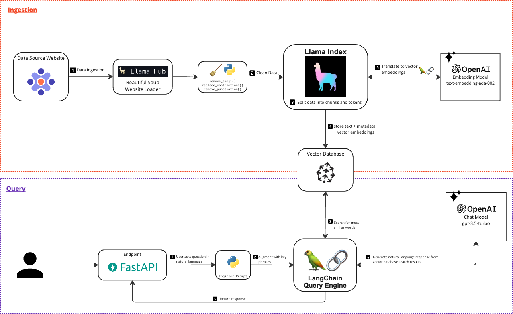

# Focused Labs Developer Kit · Getting Started · The Basics/Bare Minimum

## Hello

This tutorial shows you how to run a sample custom AI chatbot. The tutorial covers The Basics or the bare minimum.

## Objectives

- Ingest data into a vector database
- Query the vector database
- Query an agent that decides whether or not to query the vector database

## Overview



## Prerequisites

1. A Pinecone Vector Database. You can create a free account [at Pinecone's website](https://www.pinecone.io/).
2. An Open AI API account. You can sign up [at Open AI's website](https://platform.openai.com/signup).
3. Python (and your favorite IDE). We are using python v3.10.7.
4. Your favorite API client tool (our favorite is Postman, or you can use CLI curl)

## Set up your environment

1. Install dependencies: `pip install -r requirements.txt`
2. Start the app: `python3 main.py`
3. With your favorite API client tool, send a `get` request to the root endpoint (`localhost:8000/`)

If you receive the message “Hello World”, you are good to go 🎉

## Ingesting Data


### Set up Infrastructure

We recommend setting up a Pinecone vector database. Many awesome vector databases exist, but Pinecone is an industry favorite. Pinecone is a native vector database which increases the accuracy of search results. The database is managed and provides a dashboard out of the box.

1. **Set up your vector database**
    - Create an index, give it a name.
    - The index dimension is 1536. This is the number of output dimensions from Open AI's embedding model *`*text-embedding-ada-002*`*. [Source](https://platform.openai.com/docs/guides/embeddings/what-are-embeddings)    **
2. **************************************Update environment variables**************************************
- Create a `.env` file that contains the following:

```markdown
OPENAI_API_KEY=<insert OpenAI API key>
PINECONE_API_KEY=<insert Pinecone API Key>
```

- **In the *`*config.py*`* file, you will need to update Pinecone information

```markdown
PINECONE_INDEX=<name of your index>
PINECONE_ENVIRONMENT=<name of your pinecone environment, ex: asia-southeast1-gcp-free>
```

### Run App

This developer kit contains a loader for scraping a website. This is located in *`*import_service.py*`*

1. Start the app: `python3 main.py`
2. Send a `POST` **request to the endpoint `/load-website-docs` with the following body:

```json
{
page_urls: [""]
}
```

Example:

```json
{
  page_urls: [
    "https://focusedlabs.io",
    "https://focusedlabs.io/about",
    "https://focusedlabs.io/contact",
    "https://focusedlabs.io/case-studies",
    "https://focusedlabs.io/case-studies/agile-workflow-enabled-btr-automation",
    "https://focusedlabs.io/case-studies/hertz-technology-new-markets",
    "https://focusedlabs.io/case-studies/aperture-agile-transformation",
    "https://focusedlabs.io/case-studies/automated-core-business-functionality"
  ]
}
```

******************Outcome:****************** 
You'll see the vector number increase in your Pinecone dashboard. Yay!!! Now you have data you can query.

## Query Data

### Search the Database

Starting with the bare minimum. First, we'll make sure we can query the database. This will execute semantic search on the data you've loaded. For more details on what semantic search with Pinecone looks like, start with [this article](https://www.pinecone.io/learn/search-with-pinecone/)

1. Start the app: `python3 main.py`
2. Send a `POST` **request to the endpoint `/search-database` with the following body:

```json
{
"text": ""
}
```

Example:

```json
{
"text": "What solutions did Focused Labs provide for Hertz?"
}
```

******************Outcome:****************** 
You’ll receive an answer from the database.

### Query an agent

Ok, you can retrieve data from the database. But what happens when a user asks unrelated questions like "who are you?"We need to add an agent. You can think of agents as the brain behind deciding what tool to use. Sometimes, you need to query the database. Sometimes you don't. The agent decides.

1. Start the app: `python3 main.py`
2. Send a `POST` **request to the endpoint `/ask-agent` with the following body:

```json
{
"text": ""
}
```

Example:

```json
{
"text": "Who are you?"
}
```

******************Outcome:****************** 
You’ll receive an answer from the agent.

## FAQ

- If you run into a *`*PermissionError: [Errno 13] Permission denied:*`* then make sure you are running your app with Python3